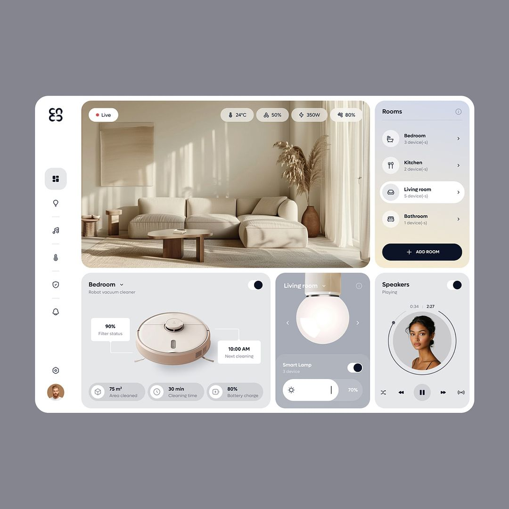

# Cace

Cace is a smart home interface built using Next.js and TypeScript. This project is a practice exercise focused on creating a sleek, modern, and responsive UI inspired by smart home control panels.



## Features

- **Room Control:** Switch between different rooms to monitor and control devices.
- **Device Management:** Monitor device status, battery levels, and schedule tasks.
- **Live Monitoring:** View live data such as temperature, humidity, and power consumption.
- **Multimedia Control:** Control speakers, lights, and other smart devices.
- **Responsive Design:** Fully responsive layout for different screen sizes.

## Tech Stack

- **Frontend:** Next.js (React) with TypeScript
- **Styling:** CSS with Tailwind CSS for utility-first styling
- **State Management:** React Context API (or consider Zustand, Recoil, etc.)
- **Icons:** Consider using Font Awesome, Material Icons, or any other icon library
- **API:** Mock data or integrate with a real-time API for live updates

## Getting Started

### Prerequisites

- Node.js (v14 or above)
- npm or yarn

### Installation

1. Clone the repository:

   ```bash
   git clone https://github.com/KigoJomo/cace.git
   cd cace
   ```

2. Install dependencies:

   ```bash
   npm install
   ```

   or

   ```bash
   yarn install
   ```

### Running the Project

1. Start the development server:

   ```bash
   npm run dev
   ```

   or

   ```bash
   yarn dev
   ```

2. Open [http://localhost:3000](http://localhost:3000) in your browser to see the interface.

### Building for Production

To create an optimized production build:

```bash
npm run build
npm run start
```

or

```bash
yarn build
yarn start
```

### Folder Structure

```bash
.
├── app
│   ├── favicon.ico           # Favicon for the app
│   ├── globals.css           # Global CSS styles
│   ├── layout.tsx            # Layout component
│   └── page.tsx              # Main page component
├── public
│   ├── images                # Image assets
│   │   ├── lamp.webp         # Image for smart lamp
│   │   ├── profile.webp      # User profile image
│   │   ├── robot.webp        # Image for robot vacuum cleaner
│   │   └── user.webp         # Another user-related image
│   ├── next.svg              # Next.js logo
│   └── vercel.svg            # Vercel logo
├── .eslintrc.json            # ESLint configuration
├── .gitignore                # Git ignore file
├── next.config.js            # Next.js configuration
├── next-env.d.ts             # TypeScript environment configuration
├── package.json              # NPM project metadata
├── postcss.config.js         # PostCSS configuration
├── tailwind.config.js        # Tailwind CSS configuration
├── tsconfig.json             # TypeScript configuration
└── README.md                 # Project documentation
```

### Contributing

If you have suggestions for improvements or find a bug, feel free to create an issue or submit a pull request.

### License

This project is open-source and available under the [MIT License](LICENSE).
